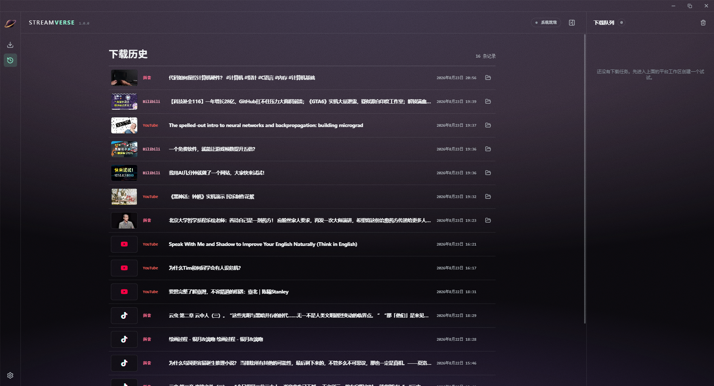
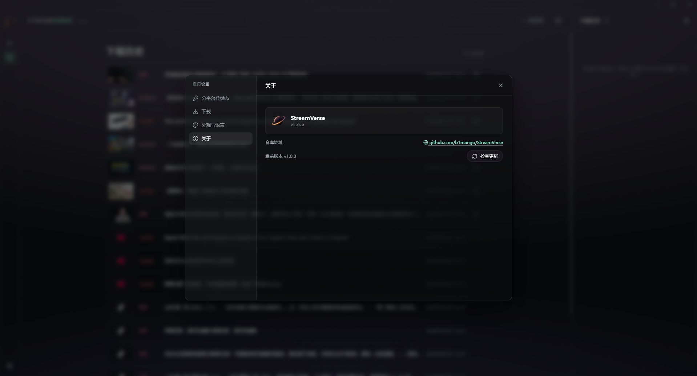

# StreamVerse

<p align="center">
  
</p>

<p align="center">Desktop video downloader for Douyin, Bilibili, and YouTube</p>

<p align="center">
  <a href="https://github.com/b1mango/StreamVerse/releases"></a>
  
  <a href="LICENSE"></a>
</p>

<p align="center"><a href="README.md">中文</a> · English</p>

## Features

- Single-video analysis and multi-quality downloads for Douyin, Bilibili, and YouTube
- Profile batch downloads for Douyin/Bilibili plus YouTube channels and playlists
- Video, MP3 audio, watermark-free albums, covers, and captions
- Scoped browser-cookie import, manual cookies, and `cookies.txt` support
- Live progress, speed, and ETA with pause, resume, cancel, and retry controls
- Windows bundles yt-dlp, FFmpeg, Deno, aria2, and the parser helper

## Interface


| Download history | Settings |
| :---: | :---: |
|  |  |

## Install

Download the Windows `.exe` or macOS `.dmg` from [GitHub Releases](https://github.com/b1mango/StreamVerse/releases). Choose a download directory, configure platform authentication, then paste a link to analyze and download.

## Development

Requires Node.js 22, Python 3.11 (helper build only), and Rust stable.

```powershell
npm ci
python -m pip install -r requirements-douyin-helper.txt pyinstaller==6.22.0
npm run build:helper
npm run prepare:sidecars
npm run check
npm test
npm run tauri:dev
```

Pinned sidecar versions and SHA-256 hashes live in `sidecars.lock.json`. The Windows bundle includes aria2 under GPL-2.0-or-later together with its license and corresponding source archive.

## License

[MIT](LICENSE)
