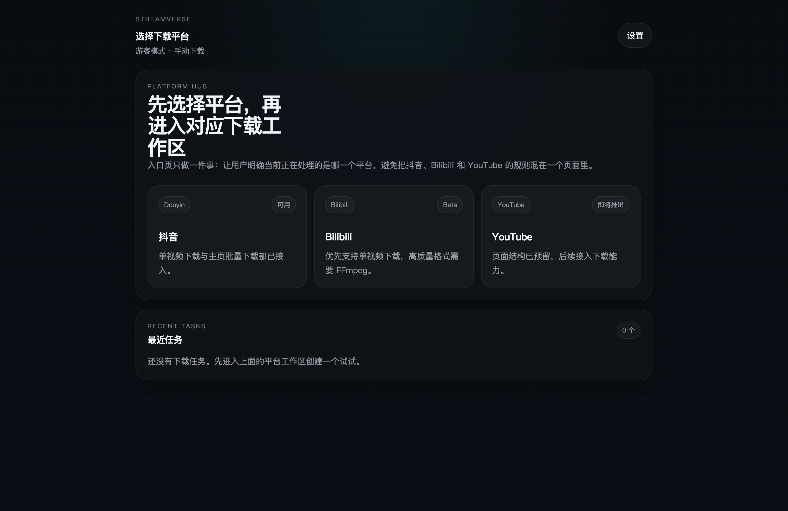
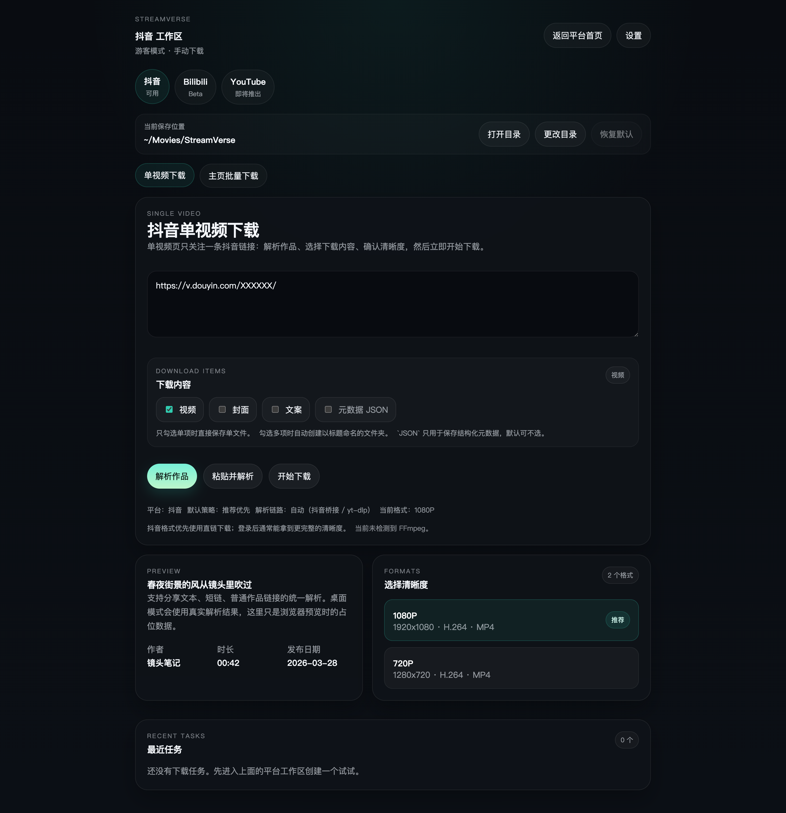
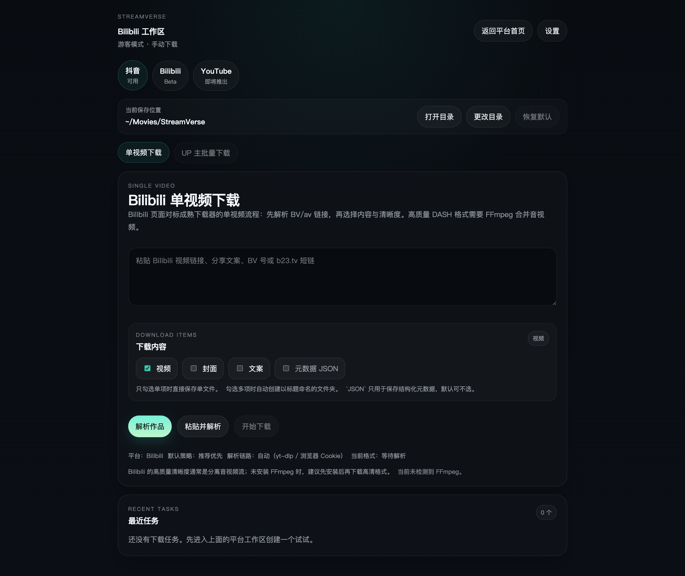

# StreamVerse

<p align="center">
  
</p>

<p align="center">
  面向桌面的多平台视频解析与下载工具，基于 Tauri 2、Rust 和 Svelte 5 构建。
</p>

<p align="center">
  <a href="https://github.com/b1mango/StreamVerse/releases"></a>
  
  
  
  
</p>

<p align="center">
  中文 README · <a href="README.en.md">English</a>
</p>

## 项目简介

StreamVerse 提供统一的桌面工作台，用于处理抖音、Bilibili 和 YouTube 的视频解析、格式选择与下载任务。项目重点放在本地桌面体验、任务队列管理，以及面向国内网络环境的代理与认证隔离策略。

当前版本聚焦以下能力：

- 抖音单视频下载与主页批量下载
- Bilibili 单视频下载与 UP 主投稿批量下载
- YouTube 单视频下载
- 视频、封面、文案、元数据等多种下载产物
- 实时任务队列、失败重试、断点后的历史保留

## 功能特性

### 下载工作流

- 单视频与主页批量工作流分离，按平台分别提供独立工作区。
- 批量任务支持预览、搜索、勾选、清晰度选择后再入队。
- 下载内容可按需选择视频、封面、文案和元数据。
- 支持高质量格式合流，打包版本内置 `FFmpeg`，无需额外安装。
- YouTube 下载启用分片并发，提升 DASH 流的吞吐表现。
- 下载限速对直链下载和 `yt-dlp` 路径统一生效。

### 认证与网络策略

- 抖音、Bilibili、YouTube 采用分平台认证配置，浏览器来源与 `cookies.txt` 相互独立。
- 导入 `cookies.txt` 时会进行关键登录字段预检，提前暴露配置问题。
- 仅 YouTube 使用代理配置；抖音与 Bilibili 保持直连，避免国内 CDN 绕行。
- Windows 下针对 Chrome 的 Cookie 限制提供明确引导，优先建议手动导出 `cookies.txt`。

### 桌面体验

- Windows 使用原生窗口按钮与标题栏行为，macOS 使用系统原生窗口样式。
- 批量解析与下载提供实时进度、速度和 ETA。
- 已完成任务支持一键在文件管理器中定位文件。
- 任务历史在应用重启后保留，可对失败或取消任务直接重试。
- 设置面板集中管理下载路径、并发数、代理、限速、通知和平台认证。

### 架构与运行时

- 前端基于 Svelte 5，后端由 Rust 驱动任务调度、网络请求和本地文件操作。
- 下载链路以 `yt-dlp` 为核心，合流依赖 `FFmpeg`。
- 平台能力通过 pack 机制组织，便于按模块演进和替换。
- 抖音主页批量读取依赖内置 Python 辅助脚本和浏览器桥接逻辑。
- 当前仍保留 Python 辅助链路，但路线已经收敛为“仅保留批量读取场景，后续逐步迁移到 Rust，本地脚本作为 fallback”。

## 平台支持

| 平台 | 单视频下载 | 主页批量下载 | 认证方式 |
| --- | :---: | :---: | --- |
| 抖音 | 支持 | 支持 | 浏览器读取 / `cookies.txt` |
| Bilibili | 支持 | 支持 | 浏览器读取 / `cookies.txt` |
| YouTube | 支持 | 暂不支持 | 浏览器读取 / `cookies.txt` / 代理 |

## 界面预览

| 首页 | 抖音工作区 | Bilibili 工作区 |
| :---: | :---: | :---: |
|  |  |  |

## 安装

预编译安装包可从 [GitHub Releases](https://github.com/b1mango/StreamVerse/releases) 获取。

- Windows：NSIS 安装包（`.exe`）
- macOS：DMG 安装包

如果你只需要本地自用，推荐直接使用 Release 构建产物，而不是从源码启动。

## 使用说明

1. 在设置面板中确认默认下载路径、并发数、限速和代理策略。
2. 按平台配置认证方式。抖音和 Bilibili 推荐优先使用新鲜 Cookie；YouTube 在受限网络环境下建议配置代理。
3. 进入单视频或批量工作区，粘贴链接并解析。
4. 选择需要的格式和下载产物后入队，下载进度会在任务队列中持续更新。

## 开发环境

### 环境要求

- Node.js 22+
- Rust stable
- Python 3.10+（仅开发环境和当前批量桥接链路需要）
- Windows 或 macOS
- Chromium 内核浏览器

### 本地开发

```bash
npm ci
npm run tauri:dev
```

### 质量检查

```bash
npm run check
cargo test --manifest-path src-tauri/Cargo.toml
```

### 构建安装包

```bash
npm run tauri:build
```

说明：

- `npm run tauri:build` 会生成包含内置 `FFmpeg` 的完整安装包

## 项目结构

```text
src/                    Svelte 前端界面
src-tauri/              Rust 后端、任务调度、Tauri 配置
scripts/                Python 辅助脚本与浏览器桥接逻辑
vendor/douyin_api/      抖音批量读取依赖
registry/plugins.json   pack 注册信息
docs/                   路线图、维护文档与截图
```

## 当前限制

- YouTube 当前仅支持单视频下载，不包含频道或主页批量工作流。
- 抖音和 Bilibili 的部分链接仍依赖 Cookie 才能稳定解析。
- Windows Chrome 启用 App-Bound Encryption 后，自动读取 Cookie 可能受限，通常需要手动导出 `cookies.txt`。
- 主页批量读取聚焦已发布作品，不覆盖收藏、喜欢、直播等其他内容类型。

## 文档

- [变更记录](CHANGELOG.md)
- [贡献说明](CONTRIBUTING.md)
- [项目路线图](docs/roadmap.md)
- [项目规则](docs/project-rules.md)
- [维护上下文](docs/maintainer-context.md)

## 贡献

欢迎通过 Issue 或 Pull Request 反馈问题与改进建议。提交变更前，建议至少运行一次以下检查：

```bash
npm run check
cargo test --manifest-path src-tauri/Cargo.toml
```

## License

[MIT](LICENSE)
