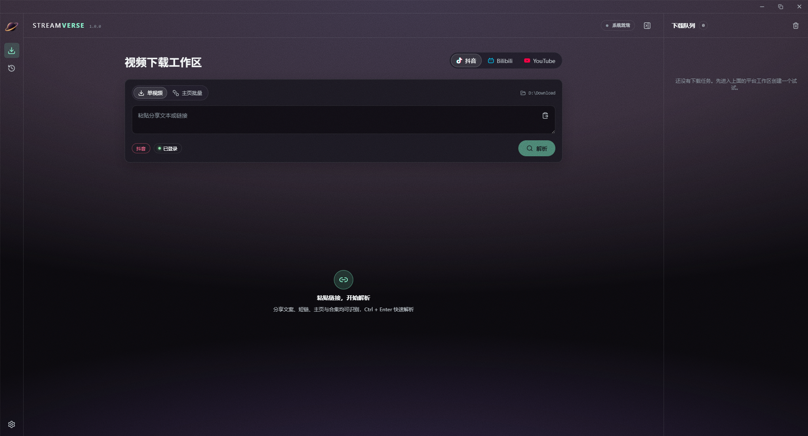
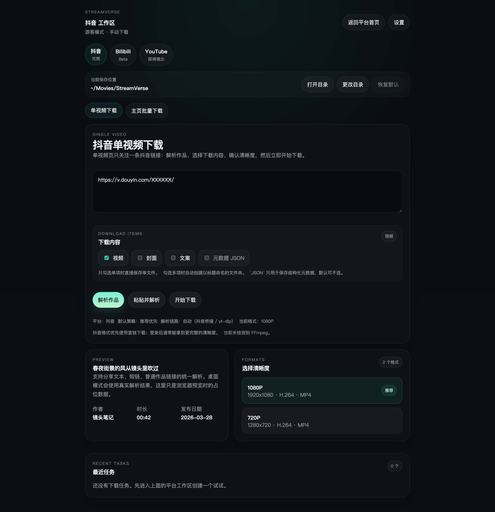
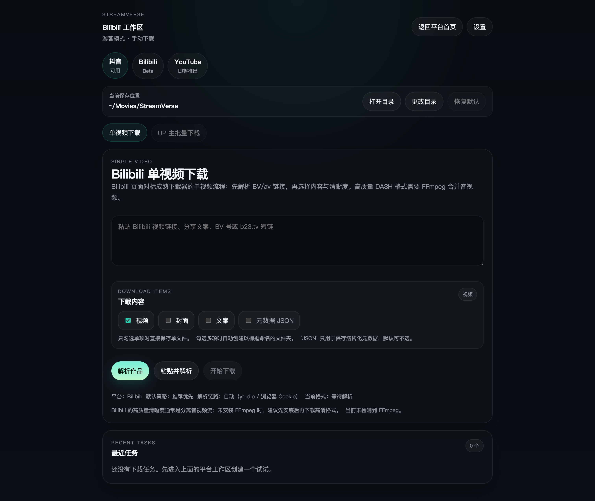

# StreamVerse

<p align="center">
  
</p>

<p align="center">
  抖音、Bilibili、YouTube 桌面视频下载工具
</p>

<p align="center">
  <a href="https://github.com/b1mango/StreamVerse/releases"></a>
  
  
</p>

<p align="center">
  中文 · <a href="README.en.md">English</a>
</p>

## 功能

**支持平台**

| 平台 | 单视频 | 主页批量 |
| --- | :---: | :---: |
| 抖音 | ✅ | ✅ |
| Bilibili | ✅ | ✅ |
| YouTube | ✅ | ✅（频道 / 合集） |

**下载内容**

- 视频（多清晰度可选，支持无水印、高码率）
- MP3 音频
- 封面图
- 文案 / 简介

**任务管理**

- 实时下载进度、速度和剩余时间
- 暂停 / 继续 / 取消 / 重试
- 下载历史保留，重启后可重试失败任务
- 完成后一键定位文件

**登录与认证**

- Windows 支持 Chrome / Edge / Firefox，macOS 支持 Chrome / Safari 的按域名 Cookie 导入
- 首次读取前显示浏览器、Profile、域名和保存位置；授权可随时撤销
- 支持手动粘贴 Cookie 文本或导入 `cookies.txt`
- 抖音、Bilibili、YouTube 各自独立配置，互不干扰

**界面**

- 暗色 / 浅色双主题
- 超过 50 项的批量列表自动虚拟化，支持复选、Shift 连选、全选和反选
- 中英文界面切换

## 界面预览

| 首页 | 抖音工作区 | Bilibili 工作区 |
| :---: | :---: | :---: |
|  |  |  |

## 安装

从 [GitHub Releases](https://github.com/b1mango/StreamVerse/releases) 下载最新版本：

- **Windows**：`.exe` 安装包
- **macOS**：`.dmg` 安装包

## 使用

1. 打开设置，选择下载目录和并发数
2. 配置登录方式（浏览器读取或导入 Cookie）
3. 粘贴视频或主页链接，点击解析
4. 选择清晰度和下载内容，入队下载

## 本地开发

需要 Node.js 22、Python 3.11（仅用于构建 helper）和 Rust stable。发布后的应用不依赖系统 Python、pip 或首次启动下载。

```powershell
npm ci
python -m pip install -r requirements-douyin-helper.txt pyinstaller==6.22.0
npm run build:helper
npm run prepare:sidecars
npm run check
npm test
npm run tauri:dev
```

`sidecars.lock.json` 固定 yt-dlp、Deno、FFmpeg 与 Windows aria2 的版本和 SHA-256；Tauri 按目标 triple 打包 `yt-dlp`、`deno`、`ffmpeg`、`streamverse-helper`。Windows 额外打包 aria2，用 16 路 Range 连接加速 YouTube HTTPS 媒体流；Deno 仅用于 yt-dlp 的 YouTube JavaScript 挑战求解，用户机器无需另行安装运行时。aria2 以 GPL-2.0-or-later 分发，其许可证与对应完整源码归档随 Windows 应用附带。

## 2.0 升级说明

2.0 不迁移 0.1 的设置、任务或 Cookie。升级后需要重新选择下载目录并授权平台登录态。

## License

[MIT](LICENSE)
