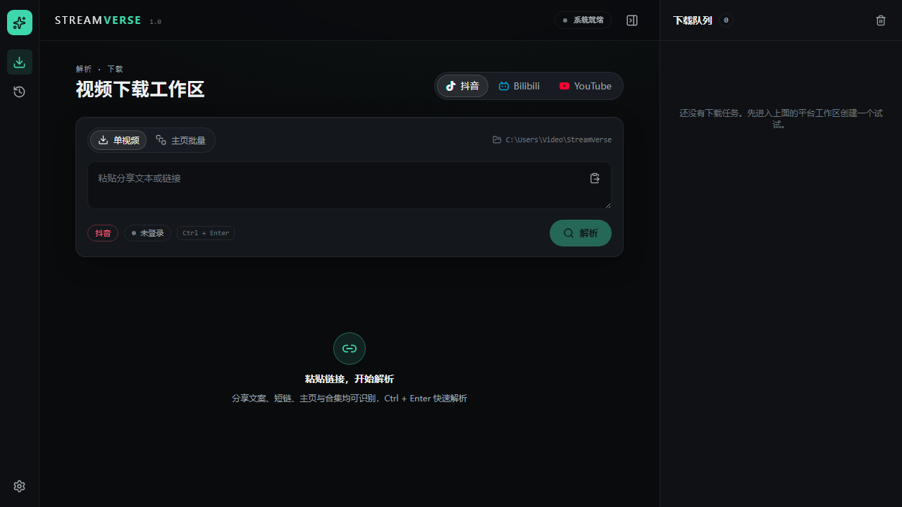
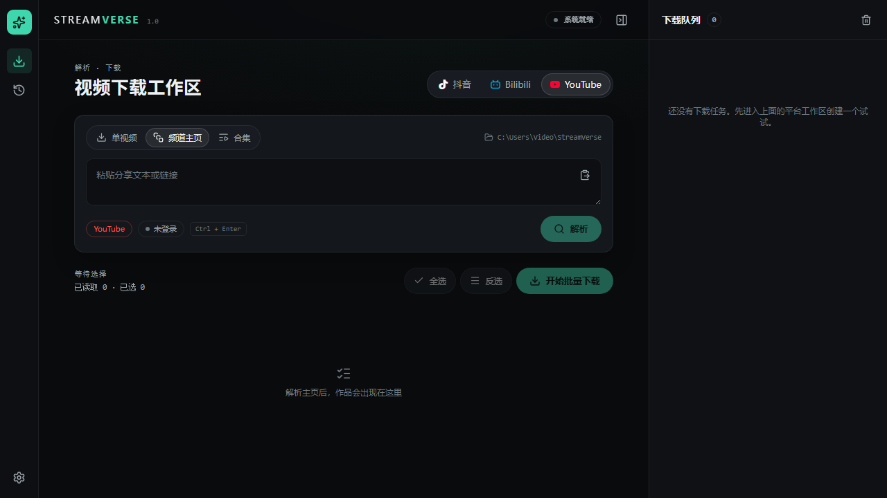
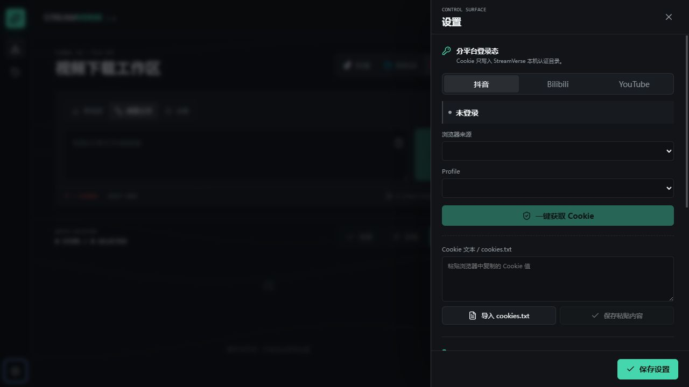

# StreamVerse

<p align="center">
  
</p>

<p align="center">抖音、Bilibili、YouTube 桌面视频下载器</p>

<p align="center">
  <a href="https://github.com/b1mango/StreamVerse/releases"></a>
  
  <a href="LICENSE"></a>
</p>

<p align="center">中文 · <a href="README.en.md">English</a></p>

## 功能

- 抖音、Bilibili、YouTube 单视频解析与多清晰度下载
- 抖音/Bilibili 主页批量，YouTube 频道与播放列表批量
- 视频、MP3 音频、无水印图册、封面和文案下载
- 浏览器 Cookie 自动读取、手动 Cookie 与 `cookies.txt` 导入
- 实时进度、速度与剩余时间，支持暂停、继续、取消和重试
- Windows 内置 yt-dlp、FFmpeg、Deno、aria2 和解析 helper

## 界面



| YouTube 批量解析 | 设置面板 |
| :---: | :---: |
|  |  |

## 安装

从 [GitHub Releases](https://github.com/b1mango/StreamVerse/releases) 下载 Windows `.exe` 或 macOS `.dmg`。打开应用后选择下载目录，配置平台登录态，然后粘贴链接解析并下载。

## 开发

需要 Node.js 22、Python 3.11（仅构建 helper）和 Rust stable。

```powershell
npm ci
python -m pip install -r requirements-douyin-helper.txt pyinstaller==6.22.0
npm run build:helper
npm run prepare:sidecars
npm run check
npm test
npm run tauri:dev
```

固定 sidecar 版本与 SHA-256 记录在 `sidecars.lock.json`。Windows 随包分发的 aria2 使用 GPL-2.0-or-later，其许可证与对应源码归档一并提供。

## License

[MIT](LICENSE)
